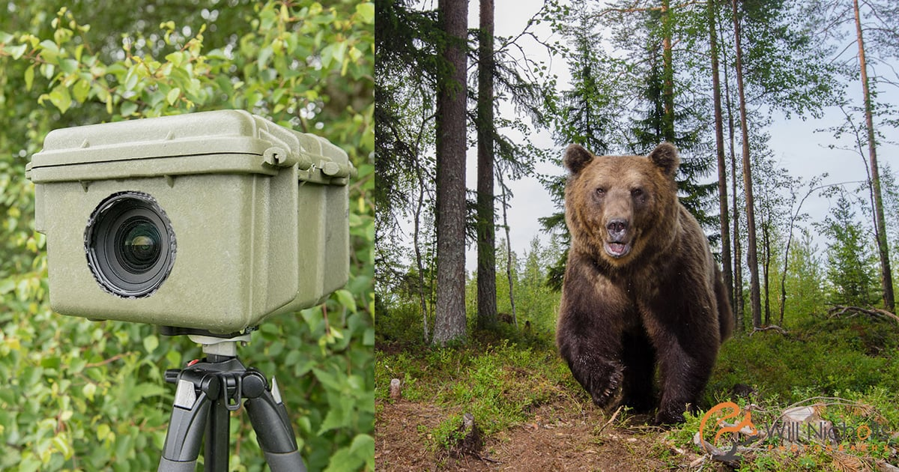

# Bear-Detection

## Overview
This repository provides a comprehensive framework for detecting and classifying bears in both images and videos using state-of-the-art deep learning models. The project is divided into two main components:



### - Bear Classification Model:

A deep learning model built with TensorFlow/Keras designed to identify images captured by camera traps that contain bears. The model has been trained primarily on images of brown bears, but it can be fine-tuned easily to recognize other bear species or even other animals, making it versatile for various wildlife monitoring tasks.

### - Bear Detection Model:

A YOLOv8-based model tailored for detecting bears in trail camera videos. This model allows for precise bear detection, drawing bounding boxes around detected bears in video frames. Similar to the classification model, it can be retrained on different datasets, enabling detection of other animal species in video footage.

### Key Features
#### - Flexible Model Fine-Tuning: 
Both the classification and detection models are designed to be easily adaptable. By updating the training and testing datasets, users can repurpose the models to classify or detect different animals.
#### - Seamless Dataset Integration: 
The detection model is compatible with external datasets labeled through platforms like Roboflow, allowing users to quickly train the model on new species.
#### - Pre-trained Weights Support: 
Users can start with pre-trained weights to accelerate the setup process or choose to train the models from scratch.
#### - End-to-End Video Processing: 
The detection model includes a pipeline for processing videos, where it automatically detects and highlights bears in each frame, making it ideal for analyzing long footage from trail cameras.

### Future developments:
- Expanding the models to classify and detect multiple species within camera trap images and videos. This functionality will be particularly beneficial for conservationists who need to track various animals simultaneously.
- Developing models to classify and detect individual animals. This feature, currently limited by data availability, has the potential to help in wildlife monitoring by allowing for the identification and tracking of specific animals over time.

## Table of Contents
Requirements
Dataset
Bear Classification Model
Bear Detection Model
Video Processing
License

To set up the project, you'll need to install several dependencies. You can do this using pip. Here’s a list of required packages:

```
pip install tensorflow keras opencv-python
pip install tensorflow-addons
pip install --upgrade typeguard
pip install ultralytics==8.0.196
pip install roboflow
pip install pyyaml
```
## Dataset
The dataset used in this project is designed for bear detection. It consists of images classified into "bear" and "other" categories and is used for both training and validation.

### Data Preparation
#### - Clone the Repository:

```
git clone https://github.com/danort92/Bear-Detection.git
cd Bear-Detection
```
#### - Data Augmentation and Splitting:
The dataset is split into training and validation sets. Images are augmented to improve model performance.
```
# Data generators
train_datagen = ImageDataGenerator(
    rescale=1./255,
    rotation_range=20,
    width_shift_range=0.2,
    height_shift_range=0.2,
    shear_range=0.2,
    zoom_range=0.2,
    horizontal_flip=True
)
val_datagen = ImageDataGenerator(rescale=1./255)

train_generator = train_datagen.flow_from_directory(
    train_dir,
    target_size=(224, 224),
    batch_size=32,
    class_mode='binary'
)
val_generator = val_datagen.flow_from_directory(
    val_dir,
    target_size=(224, 224),
    batch_size=32,
    class_mode='binary',
    shuffle=False
)

```
## Binary Classification Model
This first part of the project involves developing a deep learning model to classify images as either containing bears or not containing bears. The model is trained using the MobileNetV2 architecture, pre-trained on ImageNet, with the addition of custom layers for binary classification. The model is designed to help identify bear presence in camera trap images, which can be useful for wildlife monitoring and conservation efforts.

### Model Training

#### - Model Architecture: 
The model uses a pre-trained MobileNetV2 base, with additional layers including a global average pooling layer, a dense layer with ReLU activation, and a final dense layer with a sigmoid activation function for binary classification.
Class Weights: The class weights are computed using the balanced strategy to address any class imbalance in the training data.
#### - Training Process:
The base layers of the MobileNetV2 model are frozen during training.
The model is compiled using the Adam optimizer and binary cross-entropy loss, with accuracy and recall as the evaluation metrics.
Early stopping is implemented to prevent overfitting, monitoring the validation accuracy and restoring the best weights after 2 epochs of no improvement.

```
K.clear_session()

# Compute class weights
class_weights = class_weight.compute_class_weight(
    'balanced',
    classes=np.unique(train_generator.classes),
    y=train_generator.classes
)
class_weights = dict(enumerate(class_weights))

# Load pre-trained model
base_model = MobileNetV2(weights='imagenet', include_top=False, input_shape=(224, 224, 3))
x = base_model.output
x = GlobalAveragePooling2D()(x)
x = Dense(128, activation='relu')(x)
predictions = Dense(1, activation='sigmoid')(x)
model = Model(inputs=base_model.input, outputs=predictions)

# Freeze the base model layers
for layer in base_model.layers:
    layer.trainable = False

# Compile the model
model.compile(optimizer='adam', loss='binary_crossentropy', metrics=['accuracy', Recall()])

# Define the early stopping callback
early_stopping = EarlyStopping(
    monitor='val_accuracy',    # Monitor validation accuracy
    patience=2,
    restore_best_weights=True  # Restore the best weights
)

# Train the model with early stopping
history = model.fit(
    train_generator,
    epochs=3,
    validation_data=val_generator,
    callbacks=[early_stopping],
    class_weight=class_weights
)
```
### Model Evaluation
#### - Prediction Visualization:
The model's performance is visualized by plotting random predictions from the validation set, displaying the true labels and predicted labels for a set of images.
A custom threshold of 0.3 is used to classify the images, allowing for more flexible decision-making depending on the desired sensitivity.
#### - Metrics Plotting:
The training history, including accuracy, recall, and loss for both training and validation sets, is plotted to provide insights into the model's performance over the epochs.
#### - Confusion Matrix:
A confusion matrix is generated based on the custom threshold, providing a clear overview of the model's performance in distinguishing between 'Bear' and 'Other' images.
A detailed classification report is also generated to further evaluate the model's precision, recall, and F1-score.
```
def evaluate_with_threshold(model, generator, threshold=THRESHOLD):
    """
    Evaluate the model using a custom threshold and compute metrics.

    Args:
        model: Trained Keras model.
        generator: Data generator to provide images and labels.
        threshold: Classification threshold.
    """
    # Predict labels for the entire validation set
    all_predictions = []
    all_true_labels = []

    # Ensure generator starts from the beginning
    #generator.reset()

    # Iterate over the generator to get all images and labels
    for _ in range(len(generator)):
        images, true_labels = next(generator)
        predictions = model.predict(images)
        all_predictions.extend(predictions.flatten())
        all_true_labels.extend(true_labels.flatten())

    all_predictions = np.array(all_predictions)
    all_true_labels = np.array(all_true_labels)

    # Apply threshold to predictions
    predicted_labels = (all_predictions > threshold).astype(int)

    # Compute confusion matrix
    cm = confusion_matrix(all_true_labels, predicted_labels)
    disp = ConfusionMatrixDisplay(confusion_matrix=cm, display_labels=['Other', 'Bear'])
    disp.plot(cmap=plt.cm.Blues)
    plt.title(f'Confusion Matrix (Threshold = {threshold})')
    plt.show()

    # Print classification report
    report = classification_report(all_true_labels, predicted_labels, target_names=['Other', 'Bear'])
    print(f"\n Classification Report (Threshold = {threshold}):\n{report}")

    return predicted_labels, all_true_labels

predicted_labels, true_labels = evaluate_with_threshold(model, val_generator, threshold=THRESHOLD)
```
### Prediction and Image Upload

#### - Image Upload and Prediction:
The model allows for the upload of new images, either individually or as a zip file.
Uploaded images are classified as 'Bear' or 'Other' based on the trained model's predictions.
Images are then saved into timestamped folders (predicted_bears and predicted_others) within a predictions directory, ensuring organized storage of results.
```
def upload_and_predict(model, threshold=THRESHOLD):
    """
    Function to upload and predict on images using the trained model.
    Allows the user to upload either a single image or a zip file.
    Saves predicted Bear and Other images into separate timestamped folders.
    
    Args:
        model: Trained Keras model.
        threshold: Classification threshold.
    """
    # Create a predictions directory with a timestamp
    timestamp = datetime.now().strftime('%Y%m%d_%H%M%S')
    base_dir = f"predictions/{timestamp}"
    bear_dir = os.path.join(base_dir, "predicted_bears")
    other_dir = os.path.join(base_dir, "predicted_others")
    
    # Create directories if they don't exist
    os.makedirs(bear_dir, exist_ok=True)
    os.makedirs(other_dir, exist_ok=True)

    upload_choice = input("Do you want to upload a new image or zip file? (yes/no): ").lower()

    if upload_choice in ['yes', 'y']:
        file_choice = input("Do you want to upload a zip file? (yes/no): ").lower()

        if file_choice in ['yes', 'y']:
            print("Please upload a zip file containing your images.")
            uploaded = files.upload()

            uploaded_dir = "uploaded_images"
            if os.path.exists(uploaded_dir):
                shutil.rmtree(uploaded_dir)
            os.makedirs(uploaded_dir)

            for filename in uploaded.keys():
                if filename.endswith('.zip'):
                    with zipfile.ZipFile(filename, 'r') as zip_ref:
                        zip_ref.extractall(uploaded_dir)
                    print(f"Extracted files to '{uploaded_dir}' directory.")

            uploaded_images = [os.path.join(uploaded_dir, f) for f in os.listdir(uploaded_dir) if f.endswith(('jpg', 'jpeg', 'png'))]

            bear_count = 0
            other_count = 0

            for image_path in uploaded_images:
                image = cv2.imread(image_path)
                if image is None:
                    print(f"Error loading image: {image_path}")
                    continue

                image_resized = cv2.resize(image, (224, 224))
                image_rescaled = image_resized / 255.0
                image_batch = np.expand_dims(image_rescaled, axis=0)

                print(f"Image Shape: {image_batch.shape}")
                print(f"Image Max Value: {np.max(image_batch)}, Min Value: {np.min(image_batch)}")

                prediction = model.predict(image_batch)
                print(f"Prediction Array: {prediction}")

                label = 'Bear' if prediction < (1-threshold) else 'Other'
                print(f"Image: {os.path.basename(image_path)}, Label: {label}")

                # Save the image in the appropriate folder
                if label == 'Bear':
                    bear_count += 1
                    save_path = os.path.join(bear_dir, os.path.basename(image_path))
                else:
                    other_count += 1
                    save_path = os.path.join(other_dir, os.path.basename(image_path))
                
                cv2.imwrite(save_path, image)  # Save the image in the corresponding directory

            print(f"\nSummary:\nTotal Images: {len(uploaded_images)}\nBear Images: {bear_count}\nOther Images: {other_count}")

        else:
            print("Please upload an image file.")
            uploaded = files.upload()

            for filename in uploaded.keys():
                image_path = filename

                image = cv2.imread(image_path)
                if image is None:
                    print(f"Error loading image: {image_path}")
                    continue

                image_resized = cv2.resize(image, (224, 224))
                image_rescaled = image_resized / 255.0
                image_batch = np.expand_dims(image_rescaled, axis=0)

                print(f"Image Shape: {image_batch.shape}")
                print(f"Image Max Value: {np.max(image_batch)}, Min Value: {np.min(image_batch)}")

                prediction = model.predict(image_batch)
                print(f"Prediction Array: {prediction}")

                label = 'Bear' if prediction < (1-threshold) else 'Other'
                print(f"Image: {image_path}, Label: {label}")

                # Save the image in the appropriate folder
                if label == 'Bear':
                    save_path = os.path.join(bear_dir, os.path.basename(image_path))
                else:
                    save_path = os.path.join(other_dir, os.path.basename(image_path))
                
                cv2.imwrite(save_path, image)  # Save the image in the corresponding directory

    else:
        print("No images uploaded.")
```
## Bear Detection Model

This second part of the project focuses on detecting bears in videos using the YOLOv8 model. The setup includes options to use pre-trained weights or to train the model from scratch using a dataset either from local files or Roboflow. The user can process videos by applying the trained model to detect bears and draw bounding boxes around detected objects.

### Setup and Train YOLOv8 Model
#### - find_yaml_file: 
This function searches a specified directory for the data.yaml file, which is necessary for YOLO model training.
```
def find_yaml_file(directory, filename="data.yaml"):
    for root, dirs, files in os.walk(directory):
        if filename in files:
            return os.path.join(root, filename)
    return None
```
#### - find_data_folders: 
Automatically locates the train and validation folders within a directory structure, ensuring the model has the correct paths to training data.

```
def find_data_folders(base_dir):
    train_dir = None
    val_dir = None

    for dirpath, dirnames, filenames in os.walk(base_dir):
        if "train" in dirpath and "images" in dirpath:
            train_dir = dirpath
        elif "test" in dirpath and "images" in dirpath:
            val_dir = dirpath

    return train_dir, val_dir
```
#### - setup_bear_detection:

This function is designed to download a dataset from Roboflow and set up the necessary paths and configuration for training.
It finds the data.yaml file and updates it with the correct paths to the training and validation datasets.
```
def setup_bear_detection(api_key, workspace_name, project_name, version_number):
    rf = Roboflow(api_key=api_key)
    project = rf.workspace(workspace_name).project(project_name)
    version = project.version(version_number)
    dataset = version.download("yolov8")

    base_dir = f"/content/Bear-Detection/Bear-detection-{version_number}/"
    yaml_file_path = find_yaml_file(base_dir)
    train_path, val_path = find_data_folders(base_dir)

    if yaml_file_path and train_path and val_path:
        with open(yaml_file_path, 'r') as file:
            data = yaml.safe_load(file)
        data['train'] = train_path
        data['val'] = val_path

        with open(yaml_file_path, 'w') as file:
            yaml.safe_dump(data, file)

        return yaml_file_path, version_number

    else:
        raise FileNotFoundError("Required files or directories not found.")
```
#### - setup_bear_detection_from_local: 
Similar to the above function, but it works with datasets stored locally rather than downloading them from Roboflow.
YOLOv8 is used for detecting bears in images and videos. The dataset is downloaded from Roboflow and configured with a dynamically generated data.yaml file.
You are asked your Roboflow credentials to upload your own labelled dataset to train the model.
```
def setup_bear_detection_from_local(base_dir):
    yaml_file_path = find_yaml_file(base_dir)
    train_path, val_path = find_data_folders(base_dir)

    if yaml_file_path and train_path and val_path:
        with open(yaml_file_path, 'r') as file:
            data = yaml.safe_load(file)
        data['train'] = train_path
        data['val'] = val_path

        with open(yaml_file_path, 'w') as file:
            yaml.safe_dump(data, file)

        return yaml_file_path
```
### Handling Pre-Trained Weights
Users are prompted to decide whether to use pre-trained weights. If they choose to, they can upload a weights file or a zip file containing weights.

If no pre-trained weights are used, the script proceeds to set up and train a YOLOv8 model using either a local dataset or a Roboflow dataset.

### Model Training
If users choose to train the model from scratch:
The script sets up the YOLOv8 model, configures the training parameters (e.g., optimizer, learning rate, batch size), and trains the model.
After training, users are prompted to save the trained weights, which can then be downloaded as a zip file.

### Processing Videos

#### - process_video_with_yolo:
This function takes a video file and processes each frame using the YOLOv8 model to detect objects (in this case, bears).
Detected objects are highlighted with bounding boxes in the video frames, and the processed video is saved to an output file.
```
def process_video_with_yolo(video_path, model, output_path=None):
    cap = cv2.VideoCapture(video_path)
    if not cap.isOpened():
        print(f"Error opening video file: {video_path}")
        return

    # Get video properties
    frame_width = int(cap.get(cv2.CAP_PROP_FRAME_WIDTH))
    frame_height = int(cap.get(cv2.CAP_PROP_FRAME_HEIGHT))
    fps = cap.get(cv2.CAP_PROP_FPS)

    # Create a VideoWriter object if output_path is provided
    if output_path:
        out = cv2.VideoWriter(output_path, cv2.VideoWriter_fourcc(*'mp4v'), fps, (frame_width, frame_height))

    # Suppress output from the model prediction
    logging.getLogger('ultralytics').setLevel(logging.ERROR)

    while cap.isOpened():
        ret, frame = cap.read()
        if not ret:
            break

        frame_rgb = cv2.cvtColor(frame, cv2.COLOR_BGR2RGB)
        results = model.predict(frame_rgb, verbose=False)  # Suppress verbose output

        # Draw bounding boxes
        for bbox in results[0].boxes.xyxy:
            x1, y1, x2, y2 = map(int, bbox)
            cv2.rectangle(frame, (x1, y1), (x2, y2), (0, 255, 0), 2)
            cv2.putText(frame, 'Predicted BB', (x1, y1 - 10), cv2.FONT_HERSHEY_SIMPLEX, 0.5, (0, 255, 0), 2, cv2.LINE_AA)

        # Write the frame to the output video if output_path is provided
        if output_path:
            out.write(frame)

    cap.release()
    if output_path:
        out.release()
    cv2.destroyAllWindows()
```
 
#### - setup_and_process_videos:
This function sets up the environment for processing videos, including uploading video files, processing them with YOLOv8, and saving the output videos.
It automatically finds .mp4 files in a specified directory, processes each video using the model, and saves the results.
```
def setup_and_process_videos():
    # Directories
    video_files_dir = '/content/Bear-Detection/video_files'
    processed_videos_dir = '/content/Bear-Detection/processed_videos'

    # Create directories if they do not exist
    os.makedirs(video_files_dir, exist_ok=True)
    os.makedirs(processed_videos_dir, exist_ok=True)

    # Upload video files
    print("Upload video files:")
    uploaded = files.upload()

    # List uploaded files
    video_files = list(uploaded.keys())
    print("Uploaded video files:", video_files)

    # Save uploaded files to video_files_dir
    for video_file in video_files:
        file_path = os.path.join(video_files_dir, video_file)
        with open(file_path, 'wb') as f:
            f.write(uploaded[video_file])
        print(f"Uploaded and saved {video_file} to {video_files_dir}")

    # Automatically find all .mp4 files in the video_files_dir
    video_files = [os.path.join(video_files_dir, f) for f in os.listdir(video_files_dir) if f.endswith('.mp4')]

    # Load your model here
    model = YOLO("yolov8n.pt")  # Adjust model as needed

    # Process each video file and save the output
    for video_file in video_files:
        output_file = os.path.join(processed_videos_dir, os.path.basename(video_file).replace('.mp4', '_processed.mp4'))
        print(f"Processing video: {video_file}")
        process_video_with_yolo(video_file, model, output_file)
        print(f"Processed video saved as: {output_file}")

    # Print the directory where the processed videos are saved
    print(f"\nAll processed videos are saved in: {processed_videos_dir}")

```

Examples of processed videos:


(SHOWS OVERALL GOOD ACCURACY, NO FALSE POSITIVES NOR NEGATIVES)


(SHOWS GOOD PRECISION, BUT SPACE FOR IMPROVEMENTS REGARDING RECALL: TRAINING THE MODEL WITH A BIGGER DATASET AND MORE IMAGES OF STANDING UP BEARS WOULD DEFINTELY IMPROVE THE MODEL)

## License
This project is licensed under the MIT License. See the LICENSE file for details.

